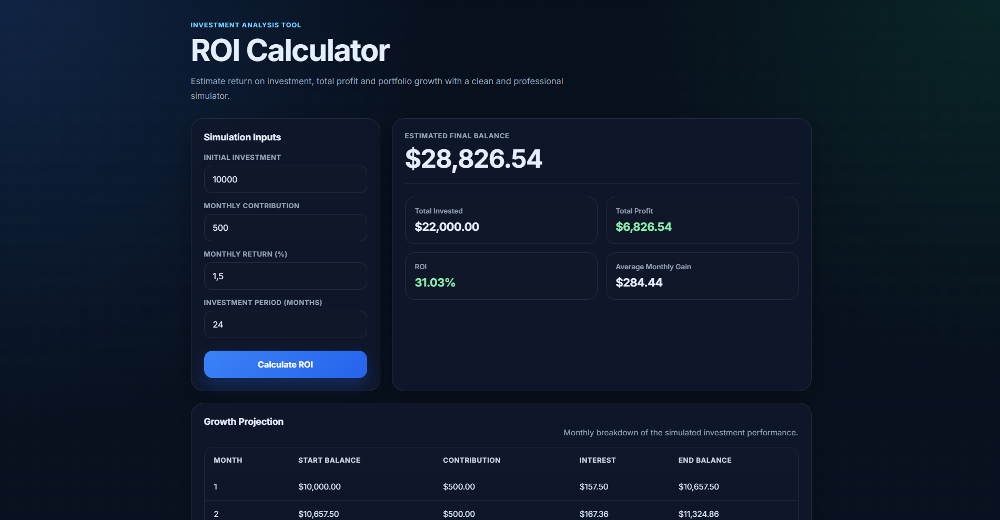

# 📈 ROI Calculator

A modern and intuitive ROI (Return on Investment) calculator built with HTML, CSS and JavaScript.

This project simulates investment growth over time using a clean, dashboard-style interface, combining real financial logic with a premium user experience.

---

## 🚀 Live Demo

(Add your GitHub Pages link here after publishing)

---

## 📸 App Preview

<p align="center">
  
</p>

---

## ✨ Features

- Investment simulation with monthly compounding
- Initial investment and monthly contribution inputs
- Estimated final balance calculation
- Total invested amount
- Total profit analysis
- ROI percentage
- Average monthly gain
- Monthly growth projection table
- Clean and professional dashboard UI
- Fully responsive design

---

## 🛠️ Tech Stack

- HTML5
- CSS3
- JavaScript (Vanilla JS)

---

## 📦 How to Run Locally

1. Clone the repository:

```bash
git clone https://github.com/kashpl/roi-calculator.git